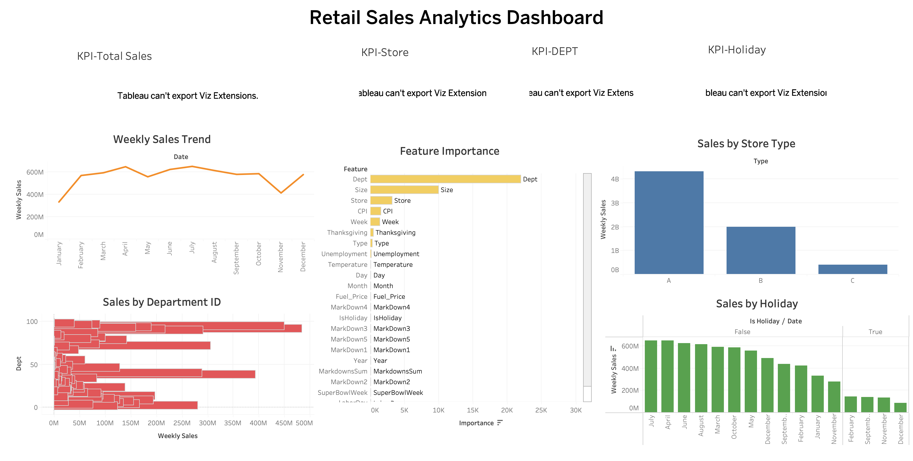
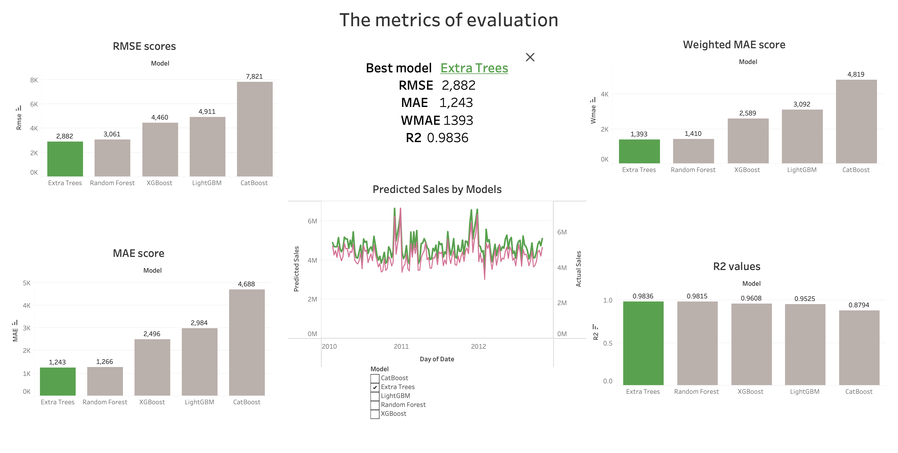

# Retail Demand Forecasting and Sales Analytics

## Overview
Built an end-to-end retail demand forecasting pipeline using Walmart sales data.

## Tools
- Python
- XGBoost
- LightGBM
- CatBoost
- Random Forest
- Extra Trees
- Tableau

## Project Workflow
1. Data cleaning and feature engineering
2. Exploratory data analysis
3. Model training and evaluation
4. Tableau dashboard development

## Model Performance

| Model | RMSE | MAE | WMAE | R² |
|---------|---------|---------|---------|---------|
| Extra Trees | 2882 | 1243 | 1393 | 0.9836 |
| Random Forest | 3061 | 1266 | 1410 | 0.9815 |
| XGBoost | 4460 | 2496 | 2589 | 0.9608 |
| LightGBM | 4911 | 2984 | 3092 | 0.9525 |
| CatBoost | 7821 | 4688 | 4819 | 0.8794 |

## Dashboards

### Sales Analytics Dashboard

### Forecasting Dashboard

